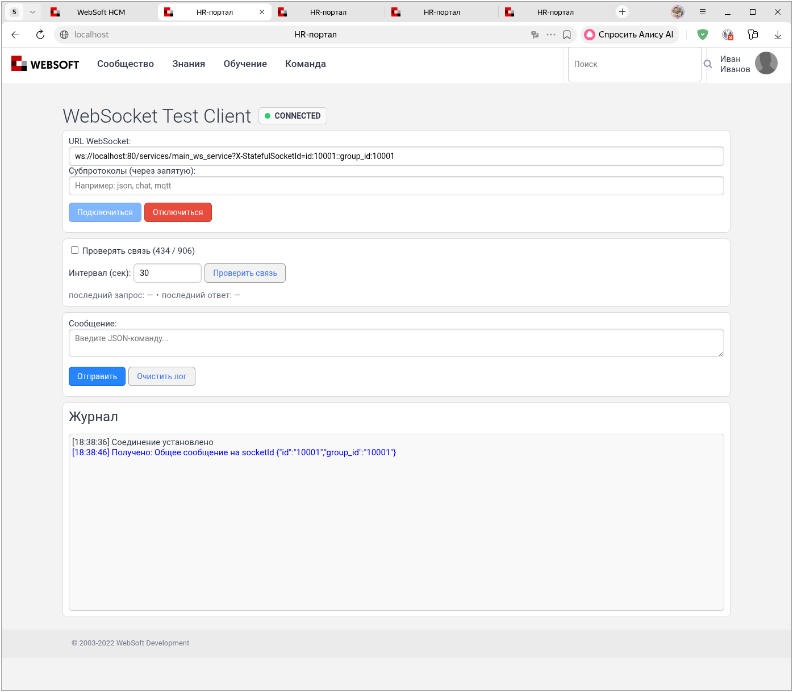
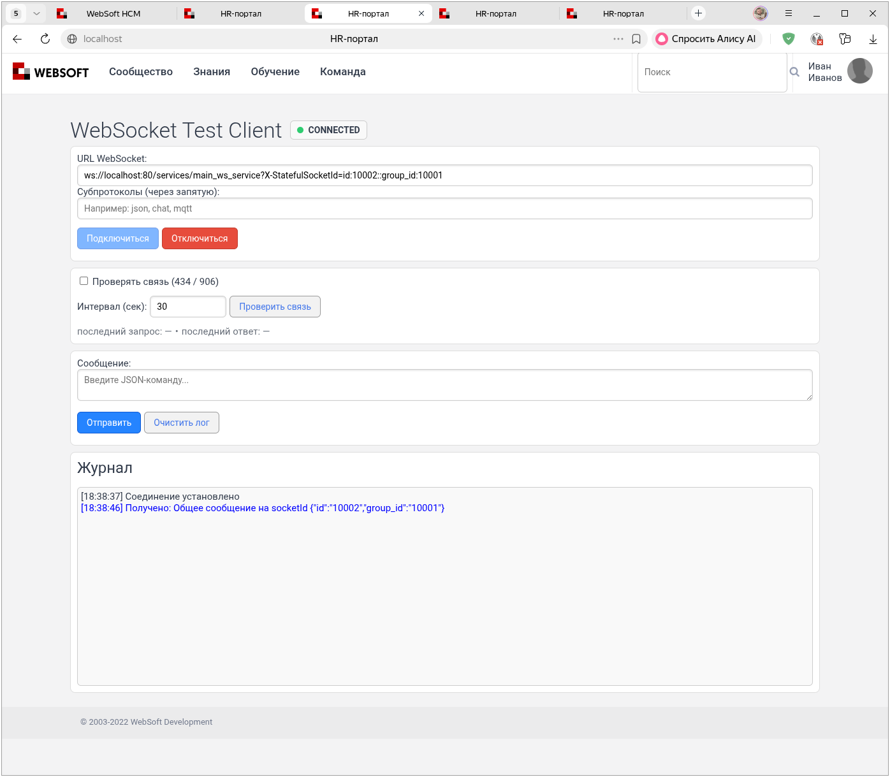
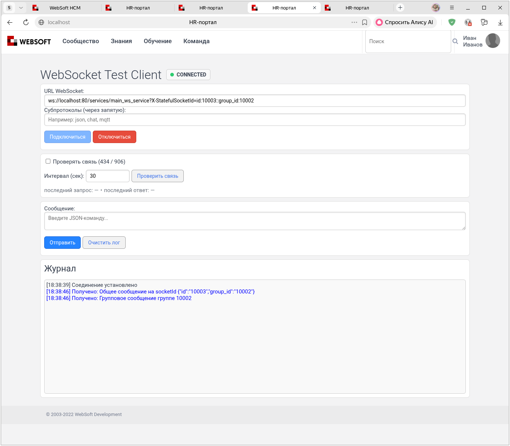
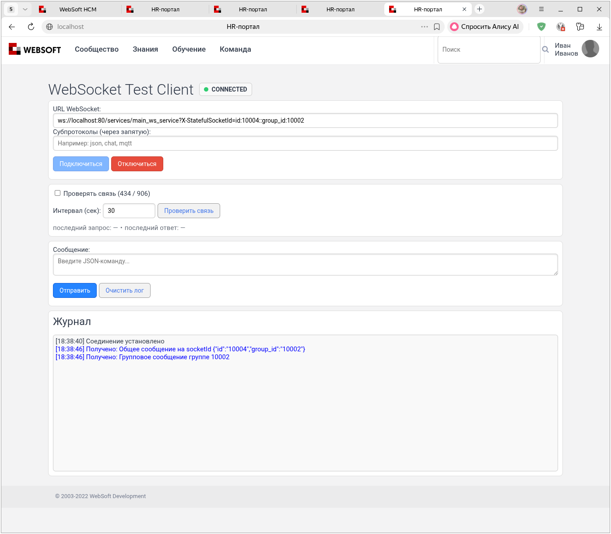
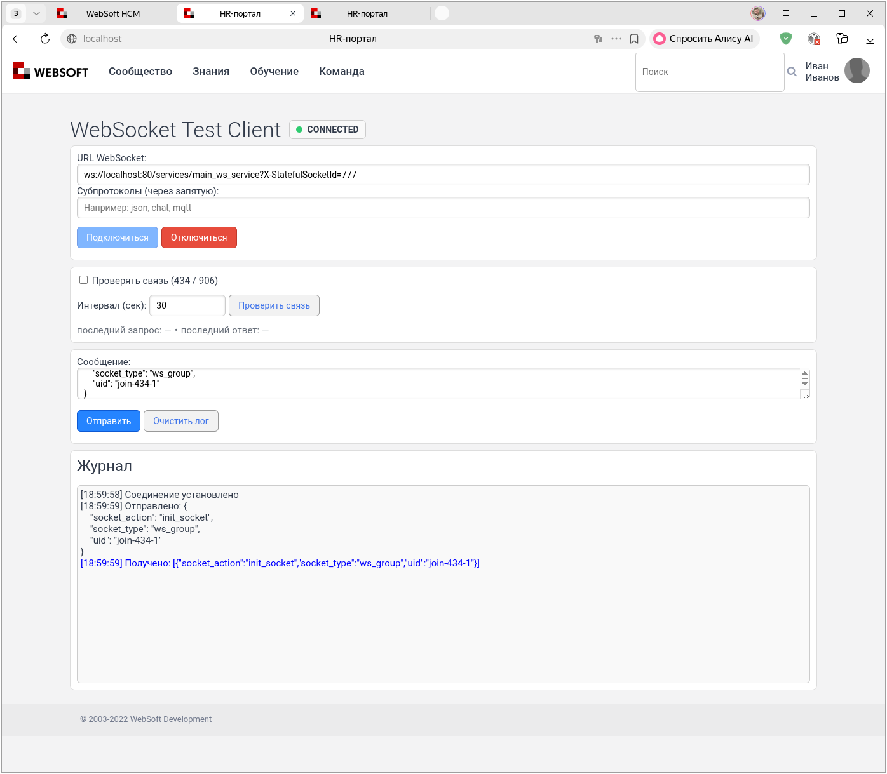
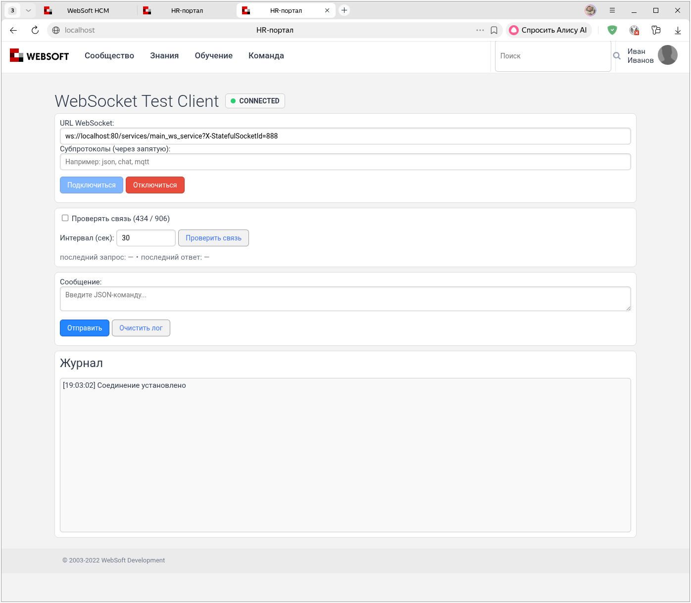
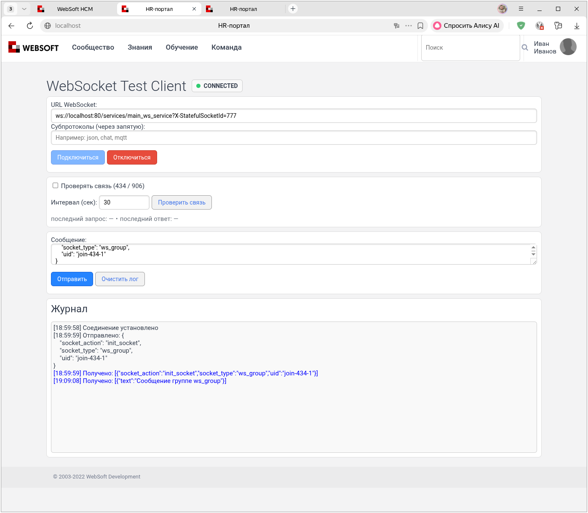

# WebSocket 434: группы клиентов

[Перед началом: отправка сообщений](messages.md).

## Вариант при первом подключении к сервису

Один из способов сгруппировать WebSocket-клиентов в сборке 434 — включить группу в значение `X-StatefulSocketId` и разбирать его при отправке. Это соглашение примера, а не встроенный формат группировки сервера.

Откройте четыре новых тестовых соединения. В этом примере группа записана в ID; команды `init_socket` не нужны. Не используйте соединения, на которых уже выполнялись примеры с JSON-командами:

```
ws://localhost:80/services/main_ws_service?X-StatefulSocketId=id:10001::group_id:10001
ws://localhost:80/services/main_ws_service?X-StatefulSocketId=id:10002::group_id:10001
ws://localhost:80/services/main_ws_service?X-StatefulSocketId=id:10003::group_id:10002
ws://localhost:80/services/main_ws_service?X-StatefulSocketId=id:10004::group_id:10002
```

Запустите агент: общее сообщение получат все соединения с подходящим форматом ID в `main_ws_service`, а групповое — только группа `10002`:

``` javascript
// Получаем доступ к сборке .NET
var xHttpStaticAssembly = tools.get_object_assembly( 'XHTTPMiddlewareStatic' );

// Получаем список всех подключённых клиентов
var WebSockets = xHttpStaticAssembly.CallClassStaticMethod( 'Datex.XHTTP.WebSocketContext', 'GetWebSockets').ToArray();

// В SP-XML Script переменные цикла нужно объявить до его запуска
var i;
var socketId;
var idParts;
var data;
var params_str;
var params;
var param_str;
var values;

// Рассылаем сообщение каждому клиенту
for (i = 0; i < WebSockets.length; i++) {
    socketId = WebSockets[i].Key;
    idParts = socketId.split('-s-');
    if (idParts.length != 2) continue;
    if (idParts[0] != '/services/main_ws_service') continue;
    data = idParts[1];
    params_str = data.split('::');
    params = {};
    for (param_str in params_str) {
        values = param_str.split(':');
        if (values.length != 2) continue;
        params.SetProperty(values[0], values[1]);
    }

    xHttpStaticAssembly.CallClassStaticMethod(
        'Datex.XHTTP.WebSocketContext',
        'WriteToWebSocketMessageQueue',
        [
            socketId,
            'Общее сообщение на socketId ' + tools.object_to_text(params, 'json'),
            false
        ]
    );

    if (params.GetOptProperty('group_id') == '10002') {
        xHttpStaticAssembly.CallClassStaticMethod(
            'Datex.XHTTP.WebSocketContext',
            'WriteToWebSocketMessageQueue',
            [
                socketId,
                'Групповое сообщение группе ' + params.GetOptProperty('group_id'),
                false
            ]
        );
    }
}
```

*группа 10001*



*группа 10001*



*группа 10002*



*группа 10002*



## Группа через `main_ws_service`

Другой способ — зарегистрировать группу сообщением в `main_ws_service`. В сборке 434 `libMain.main_socket` хранит список подписчиков через `tools_web`.

### Хранилище подписчиков

Обработчик `process` разбирает JSON и передаёт результат в `libMain.main_socket`:

``` javascript
// wtv/wtv_main_ws_service.js

function process( context ) {
    // ... код

    oMessage = ParseJson( message );
    xHttpStaticAssembly = tools.get_object_assembly( 'XHTTPMiddlewareStatic' );
    oRes = tools.call_code_library_method( 'libMain', 'main_socket', [ Request, null, Request.Session, oMessage, RValue( context.WebSocketCurrentId ) ] );

    // ... код
}
```

Действие и его параметры задаются полями JSON:

* `socket_action` — действие. Возможные значения:
    * `init_socket` — регистрирует текущий сокет пользователя в списке «подписчиков» для выбранного `socket_type`
    * `close_socket` — предназначен для удаления соединения из списка; особенность реализации описана ниже
    * `call_method` — считывает `library` и `method` и вызывает метод библиотеки через `tools.call_code_library_method( sLibrary, sMethod, [ curUserID, sWebsocketID, sAction ] )`
    * `default (прочие действия)` — действия для прокторинга и чатов.
* `socket_type` — тип подключения, из которого формируется ключ хранилища: `<socket_type> + "_recipients"`;
* `library` — код библиотеки программного кода, используется при `socket_action == call_method`
* `method` — метод библиотеки, используется при `socket_action == call_method`

Откройте новое соединение с новым ID, не использованным в опыте с обычным текстом:

```
ws://localhost:80/services/main_ws_service?X-StatefulSocketId=777
```

Чтобы добавить его в группу `ws_group`, отправьте сообщение:

``` json
{
    "socket_action": "init_socket",
    "socket_type": "ws_group",
    "uid": "join-434-1"
}
```

Сервис передаст сообщение в `main_socket`:

- Сформируется ключ `sUserDataKey` со значением `ws_group_recipients`.
- Соединение добавится в массив `result`.
- Объект сохранится вызовом `tools_web.set_user_data( sUserDataKey, { result: aRecipients }, 86400 );`

При повторной регистрации того же `socket_id` дубликат не добавляется. Запись содержит `person_id` и `socket_id`. Одно соединение можно зарегистрировать в нескольких группах: регистрация в новой группе не удаляет его из прежней.

Сервис возвращает `socket_action`, `socket_type` и переданный `uid`. При JSON-режиме очереди ответ на пример выше выглядит так:

``` json
[18:59:59] Получено: [{"socket_action":"init_socket","socket_type":"ws_group","uid":"join-434-1"}]
```

В одном кадре могут прийти несколько ответов. Значение `uid` помогает сопоставить каждый ответ с запросом; если его не передать, сервер вернёт пустую строку.



Прочитайте список подписчиков агентом:

``` javascript
res = tools_web.get_user_data("ws_group_recipients")
alert(tools.object_to_text(res, "json"))
```

Пример записи в журнале:

```
19:02:33 [0095]	{"result":[{"person_id":"6148914691236517121","socket_id":"/services/main_ws_service-s-777"}]}
```

Откройте второе соединение, но не добавляйте его в группу:



Повторно запустите агент:

``` javascript
res = tools_web.get_user_data("ws_group_recipients")
alert(tools.object_to_text(res, "json"))
```

В массиве `result` по-прежнему должна быть только запись первого соединения. `socket_id` нового соединения не появится, поскольку для него не отправлялась команда `init_socket`.

Агент ниже ставит сообщение в очередь для каждого сохранённого ID; это не подтверждение доставки.

После `init_socket` сервис уже отвечает в JSON-режиме, поэтому агент также передаёт сериализованный JSON. [Подробнее о режиме очереди](messages.md#json-queue).

Отправьте сообщение зарегистрированным участникам группы:

``` javascript
// Получим группу сокетов
try {
    ws_group_data = tools_web.get_user_data("ws_group_recipients")
    ws_group_sockets = ws_group_data.GetOptProperty("result", [])
} catch (err) {
    ws_group_sockets = []
}

// Поставим сообщения в очередь для ID из списка подписчиков
var xHttpStaticAssembly = tools.get_object_assembly( 'XHTTPMiddlewareStatic' );
for (socket in ws_group_sockets) {
    xHttpStaticAssembly.CallClassStaticMethod(
        'Datex.XHTTP.WebSocketContext',
        'WriteToWebSocketMessageQueue',
        [ socket.socket_id, EncodeJson({ text: 'Сообщение группе ws_group' }, { ExportLargeIntegersAsStrings: true }), true ]);
}
```

Сообщение должно получить только открытое соединение, добавленное в группу:




#### Отписка и отключение { #unsubscribe }

Действие `close_socket` предназначено для удаления записи из выбранного списка, а не для закрытия WebSocket. В штатной реализации сборки 434 это действие не работает.

При отправке из ранее зарегистрированного соединения команды:

``` json
{
    "socket_action": "close_socket",
    "socket_type": "ws_group",
    "uid": "leave-434-1"
}
```

в журнале сервера появляются ошибки:

``` text
main_socketcontext not defined
(x-local://wtv/libs/main_library.js, line 5938)
(ArraySelect(), x-local://wtv/libs/main_library.js, line 5938)

Unknown object property: socket_object
(x-local://wtv/wtv_main_ws_service.js, line 71)
```

Первая ошибка возникает потому, что фильтр `close_socket` обращается к `context.WebSocketCurrentId`, хотя `context` не объявлен внутри `main_socket`. Из-за сбоя `main_socket` не формирует `socket_object`, и попытка сервиса отправить это поле вызывает вторую ошибку. Запись о соединении из `ws_group_recipients` не удаляется.

Обычное отключение клиента не запускает обработчик `close_socket` автоматически. Не считайте список хранилища автоматически очищаемым списком активных соединений.
## Ограничения сервиса

### Вызов метода и права

Для регистрации группы `call_method` не нужен. Если используете его для других операций, учитывайте следующее ограничение.

!!! warning "Права при вызове метода"
    В обработчике `call_method` имена библиотеки и метода берутся из сообщения. В нём нет списка разрешённых методов. Вызываемый метод должен проверять права текущего пользователя на операцию; доступ к WebSocket не заменяет такую проверку.

### Если ответ не пришёл

Проверьте JSON команды, доступ пользователя и журнал сервера. При ошибке библиотека может заполнить `error` и `message` во внешнем результате, но сервис отправляет только `socket_object`. Поэтому нельзя рассчитывать, что любая ошибка обязательно придёт клиенту как JSON с полем `error`.

[Далее: закрытие соединений](closing.md).
