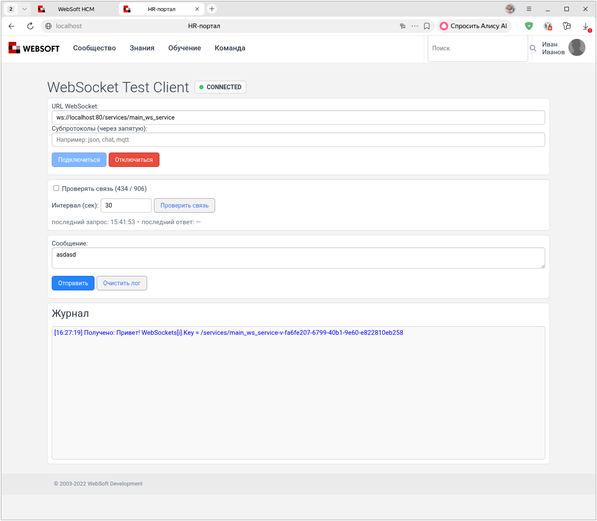
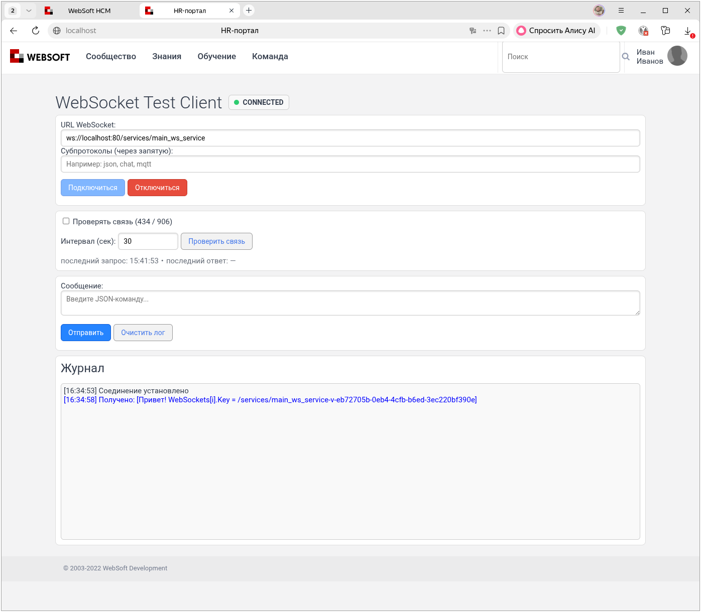
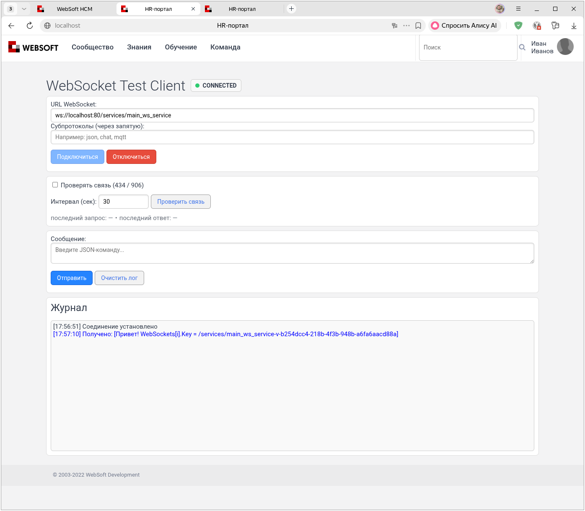
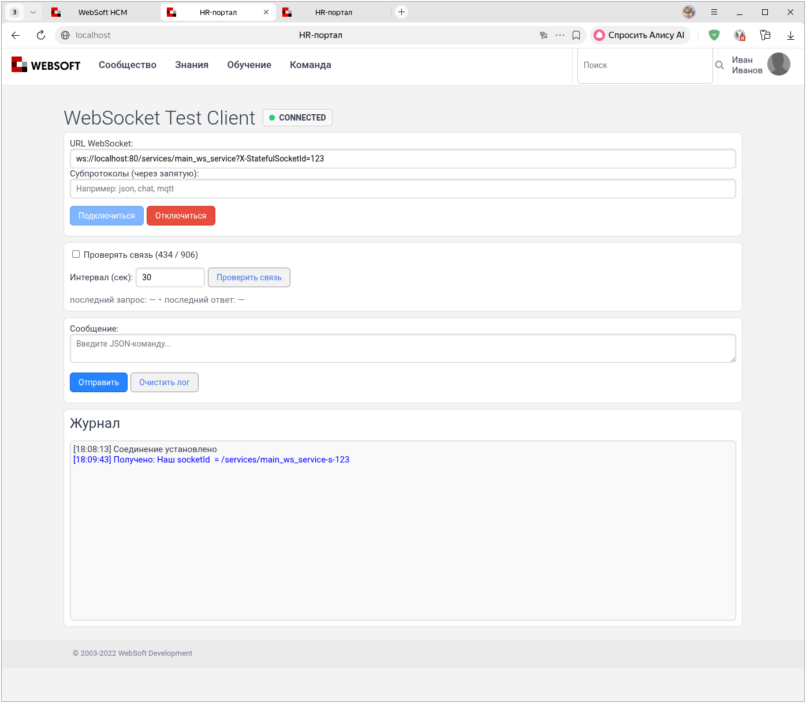
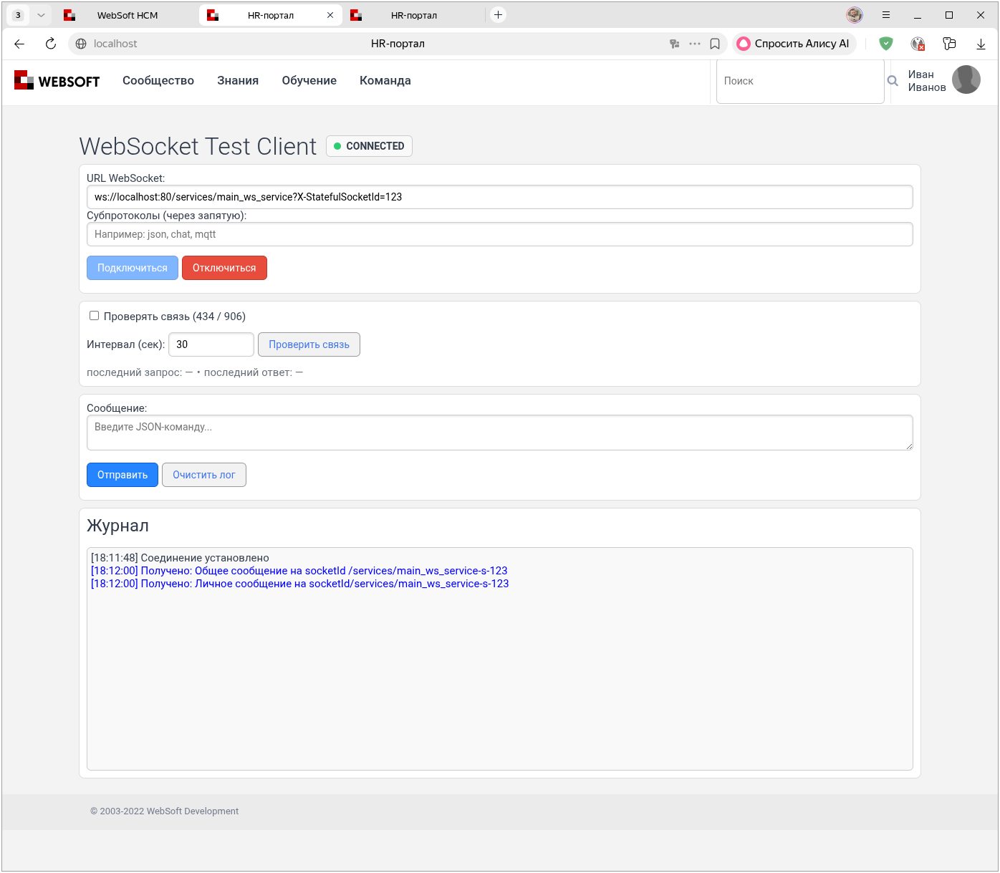
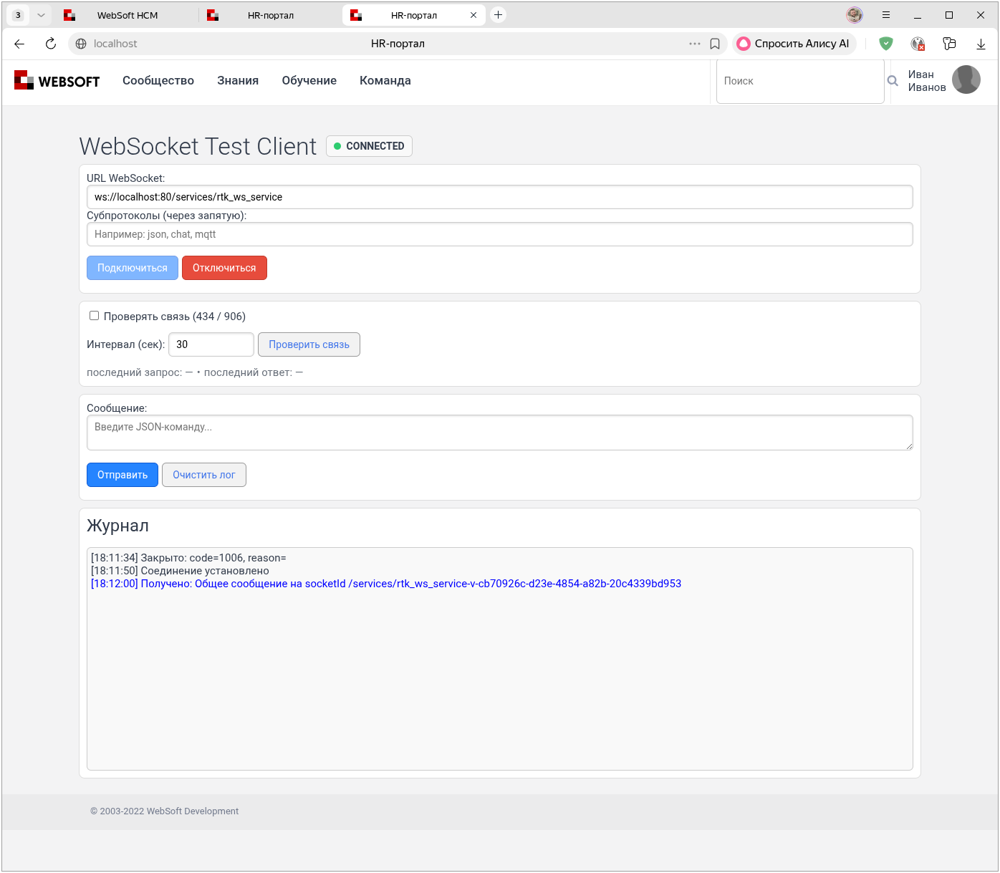
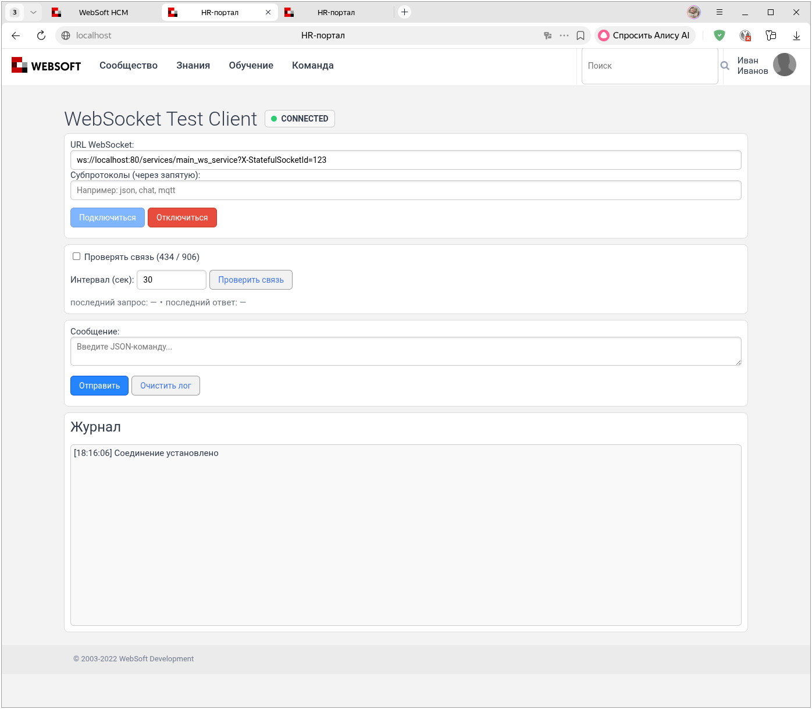

# WebSocket 434: отправка сообщений

[Перед началом: подготовка и подключение](connection.md).

## Первое сообщение

Сначала проверим отправку обычного текста **от сервера к клиенту**. Откройте новое тестовое соединение без параметра `X-StatefulSocketId`. Сервер автоматически присвоит ему ID вида `/services/main_ws_service-v-<GUID>`.

Пока не отправляйте команды серверу, включая `init_socket`: для первого сообщения очередь должна быть создана агентом в текстовом режиме.

Создайте агент со следующим кодом и запустите его. Он рассылает сообщение всем найденным соединениям, поэтому выполняйте пример только на изолированном тестовом стенде:

``` javascript
// Получаем доступ к сборке .NET
xHttpStaticAssembly = tools.get_object_assembly( 'XHTTPMiddlewareStatic' );

// Получаем список всех сокетов
WebSockets = xHttpStaticAssembly.CallClassStaticMethod( 'Datex.XHTTP.WebSocketContext', 'GetWebSockets').ToArray();

// Рассылаем сообщение каждому клиенту
for(i = 0; i < WebSockets.length; i++) {
    xHttpStaticAssembly.CallClassStaticMethod(
        'Datex.XHTTP.WebSocketContext',
        'WriteToWebSocketMessageQueue',
        [
            WebSockets[i].Key,
            'Привет! WebSockets[i].Key = ' + WebSockets[i].Key,
            false
        ]
    );
}
```

`get_object_assembly` — это функция WebTutor, которая загружает .NET-сборку (Datex.XHTTP.dll) и возвращает объект-обёртку, позволяющий вызывать статические методы классов внутри неё.

`GetWebSockets()` — это статический метод из Datex.XHTTP.WebSocketContext, который возвращает коллекцию `IEnumerable<KeyValuePair<string, WebSocket>>`, где:

* `Key` — строковый идентификатор соединения (socketId), уникальный для каждого клиента

* `Value` — объект System.Net.WebSockets.WebSocket, сам сокет клиента

В Datex.XHTTP `1.22.6.9` метод C# объявлен без параметров: `GetWebSockets()`. В распределённой конфигурации перечисление может включать удалённые соединения.

`.ToArray()` преобразует коллекцию в массив для обхода в цикле.

`WriteToWebSocketMessageQueue` добавляет сообщение в очередь указанного соединения. Внутренний обработчик `WebSocketContext` отправляет сообщения асинхронно. Параметры:

* `socketId` — идентификатор WebSocket-соединения (тот самый WebSockets[i].Key)

* `message` — текст сообщения, который будет отправлен клиенту

* `json_compound` — режим объединения сообщений очереди; для обычного текста используйте `false`

На клиенте появится строка `Привет! WebSockets[i].Key = ...` с автоматически созданным ID соединения.



### Режим очереди `json_compound` { #json-queue }

Это по-прежнему отправка сообщений **от сервера к клиенту**. Параметр `json_compound` определяет, в каком виде DLL забирает сообщения из серверной очереди перед отправкой:

- `false` — каждое сообщение отправляется без дополнительной упаковки;
- `true` — DLL объединяет накопленные элементы очереди и заключает их в JSON-массив.

В сборке 434 режим запоминается при создании очереди соединения. Последующий вызов с другим значением не переключает уже существующую очередь.

Именно поэтому для первого примера нужно новое соединение без предварительных команд. Если клиент уже отправил `init_socket`, сервис `main_ws_service` сформировал ответ через `WriteToWebSocketMessageQueue(..., true)` и тем самым мог первым создать для соединения очередь в режиме JSON. После этого обычная строка от агента попадёт в ту же очередь и будет обёрнута в квадратные скобки.

В Datex.XHTTP `1.22.6.9` режим `json_compound = true` не превращает произвольный текст в JSON: обработчик соединяет сообщения запятыми и добавляет `[` и `]`. Сериализуйте каждый объект заранее, например через `EncodeJson(oMessage)`.

В сборке 434 внешние скобки добавляются всегда. Передавайте отдельные JSON-объекты, а не готовые массивы.

Для сравнения режимов используйте разные подключения. Результат с `json_compound = false` показан в первом примере выше. Ниже показана та же обычная строка при `json_compound = true`: наличие квадратных скобок само по себе не означает корректный JSON.



!!! warning "Важно"
    Первый пример рассылает сообщение всем найденным WebSocket-соединениям, включая подключения к другим сервисам.

    Чтобы увидеть это поведение, [создайте копию `main_ws_service`](connection.md#service-copy) с именем `rtk_ws_service`, подключитесь к обоим сервисам и повторно запустите агент массовой рассылки:

    

    

## Отправка конкретному клиенту

Без заданного идентификатора соединение получает `socketId` вида `/services/main_ws_service-v-<GUID>`.

Чтобы задать идентификатор, передайте параметр запроса `X-StatefulSocketId`. Полный ID включает путь сервиса: `/services/main_ws_service-s-123`.

Если соединение с таким ID ещё активно, сервер отменяет его обработку и прерывает новое подключение. После освобождения ID можно подключиться снова, но одинаковый ID сам по себе не восстанавливает прикладное состояние. Механизм повторной доставки очереди зависит от настроек stateful-сокетов.

```
ws://localhost:80/services/main_ws_service?X-StatefulSocketId=123
```

Создайте агент со следующим кодом и запустите его. Агент отправит каждому соединению его ID:

``` javascript
xHttpStaticAssembly = tools.get_object_assembly( 'XHTTPMiddlewareStatic' );
WebSockets = xHttpStaticAssembly.CallClassStaticMethod( 'Datex.XHTTP.WebSocketContext', 'GetWebSockets').ToArray();

for(i = 0; i < WebSockets.length; i++) {
    xHttpStaticAssembly.CallClassStaticMethod(
        'Datex.XHTTP.WebSocketContext',
        'WriteToWebSocketMessageQueue',
        [
            WebSockets[i].Key,
            'Наш socketId  = ' + WebSockets[i].Key,
            false
        ]
    );
}
```

*ID соединения в сообщении сервера*



Откройте два соединения: одно без параметра `X-StatefulSocketId`, другое — со значением `123`. Следующий агент отправляет общее сообщение всем соединениям, а личное — только соединению `/services/main_ws_service-s-123`.

``` javascript
// Получаем доступ к сборке .NET
xHttpStaticAssembly = tools.get_object_assembly( 'XHTTPMiddlewareStatic' );

// Получаем список всех подключённых клиентов
WebSockets = xHttpStaticAssembly.CallClassStaticMethod( 'Datex.XHTTP.WebSocketContext', 'GetWebSockets').ToArray();

// Рассылаем сообщение каждому клиенту
for(i = 0; i < WebSockets.length; i++) {
    socketId = WebSockets[i].Key
    xHttpStaticAssembly.CallClassStaticMethod(
        'Datex.XHTTP.WebSocketContext',
        'WriteToWebSocketMessageQueue',
        [
            socketId,
            'Общее сообщение на socketId ' + WebSockets[i].Key,
            false
        ]
    );

    if (socketId != '/services/main_ws_service-s-123') continue
    xHttpStaticAssembly.CallClassStaticMethod(
        'Datex.XHTTP.WebSocketContext',
        'WriteToWebSocketMessageQueue',
        [
            socketId,
            'Личное сообщение на socketId' + WebSockets[i].Key,
            false
        ]
    );
}
```

*Клиент с заданным `X-StatefulSocketId`*



*Клиент с автоматически созданным ID*



!!! warning "Важно"
    Значение `X-StatefulSocketId` должно быть уникальным в пределах сервиса. Соединения с одинаковым значением у `main_ws_service` и `rtk_ws_service` имеют разные полные ID:

    

    

    Оба соединения могут оставаться активными одновременно.

[Далее: группы клиентов](groups.md).
