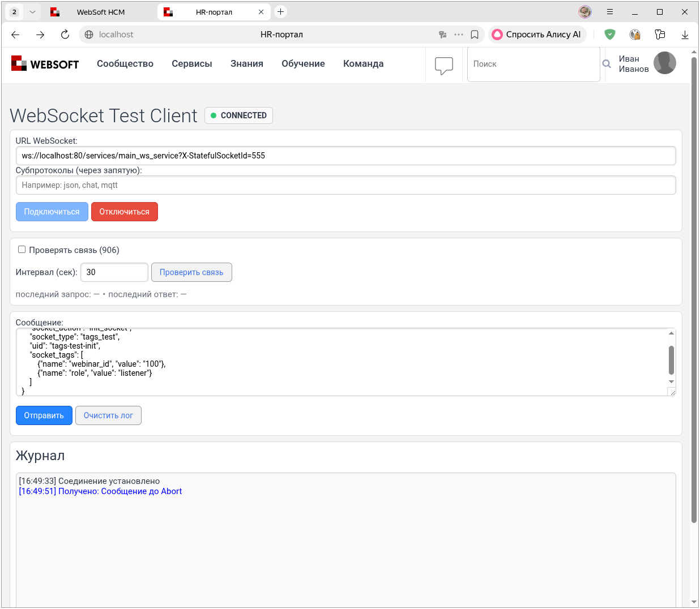
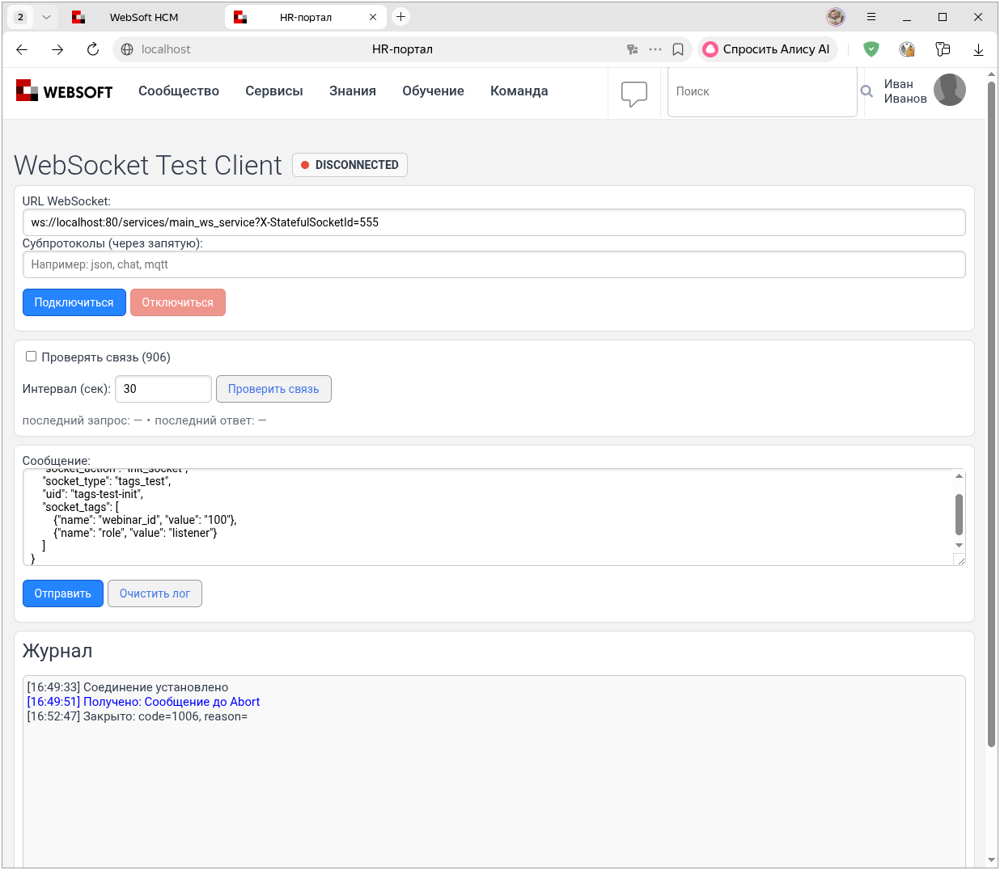

# WebSocket 906, 1132 и 1333: закрытие соединений

Примеры этой главы проверены на стенде 906. Методы `Abort` и
`GetWebSockets`, используемые ниже, доступны во всех рассматриваемых сборках.

Команда `{"socket_action":"close_socket"}` в `main_socket` не закрывает
соединение и не удаляет его теги: ветка обработчика пуста во всех
сборках 906, 1132 и 1333. Для обычного закрытия со стороны тестового
клиента нажмите «Отключиться». Принудительное прерывание через `Abort()`
проверено ниже только на стенде 906.

Обработчик `close(context)` одинаков в сборках 906, 1132 и 1333. При
завершении соединения он ставит `check_socket` в очередь методом, который не
возвращает результат доставки. Этот вызов нельзя использовать как подтверждение
получения сообщения клиентом.

## Abort

Метод прерывает соединение, а не выполняет согласованное закрытие через `CloseAsync`. В Datex.XHTTP `1.24.4.27` локальный `DatexWebSocket.Abort()` вызывает `Abort()` базового сокета. У удалённого `DatexVirtualWebSocket` метод пустой, поэтому таким способом нельзя закрыть удалённое соединение.

Откройте отдельное тестовое соединение:

```
ws://localhost:80/services/main_ws_service?X-StatefulSocketId=555
```

Сначала создайте и запустите агент для проверки доставки:

``` javascript
var xHttpStaticAssembly = tools.get_object_assembly( 'XHTTPMiddlewareStatic' );
var socketId = '/services/main_ws_service-s-555';

xHttpStaticAssembly.CallClassStaticMethod(
    'Datex.XHTTP.WebSocketContext',
    'WriteToWebSocketMessageQueue',
    [ socketId, 'Сообщение до Abort', false ]
);
```



Убедитесь, что клиент получил сообщение. Затем запустите отдельный агент для `Abort()`:

``` javascript
var xHttpStaticAssembly = tools.get_object_assembly( 'XHTTPMiddlewareStatic' );
var arrWebSockets = xHttpStaticAssembly.CallClassStaticMethod(
    'Datex.XHTTP.WebSocketContext',
    'GetWebSockets',
    [null, false]
).ToArray();
var socket;
var found = false;

for (socket in arrWebSockets) {
    if (socket.Key != '/services/main_ws_service-s-555') continue;
    found = true;
    CallObjectMethod(socket.Value, 'Abort', []);
}

alert(found ? 'Abort вызван' : 'Сокет не найден');
```

```
16:52:47 [0464] Abort вызван
```



После этого запустите третий агент. Он проверит наличие ID и попробует отправить ещё одно сообщение:

``` javascript
var xHttpStaticAssembly = tools.get_object_assembly( 'XHTTPMiddlewareStatic' );
var socketId = '/services/main_ws_service-s-555';
var arrWebSockets = xHttpStaticAssembly.CallClassStaticMethod(
    'Datex.XHTTP.WebSocketContext',
    'GetWebSockets',
    [null, false]
).ToArray();
var socket;
var found = false;

for (socket in arrWebSockets) {
    if (socket.Key == socketId) {
        found = true;
        break;
    }
}

alert(found ? 'Сокет остался в GetWebSockets' : 'Сокет удалён из GetWebSockets');

xHttpStaticAssembly.CallClassStaticMethod(
    'Datex.XHTTP.WebSocketContext',
    'WriteToWebSocketMessageQueue',
    [ socketId, 'Сообщение после Abort', false ]
);
```

```
16:55:28 [0394] Сокет удалён из GetWebSockets
```

На стенде 906 подтверждено:

- до `Abort()` клиент получил контрольное сообщение;
- после `Abort()` браузер сообщил `Закрыто: code=1006, reason=`;
- ID `/services/main_ws_service-s-555` исчез из `GetWebSockets()`;
- контрольное сообщение после `Abort()` клиенту не доставлено.

Код `1006` означает аварийное завершение без кадра закрытия WebSocket. Поэтому `Abort()` в сборке 906 работает как принудительное прерывание локального соединения, но не заменяет согласованное закрытие с кодом `1000` и причиной.

Это отличается от проверенного поведения сборки 434: там вызов `Abort()` оставил ID в `GetWebSockets()`, а браузер продолжил считать соединение активным.

[К обзору сборок 906, 1132 и 1333](index.md).
