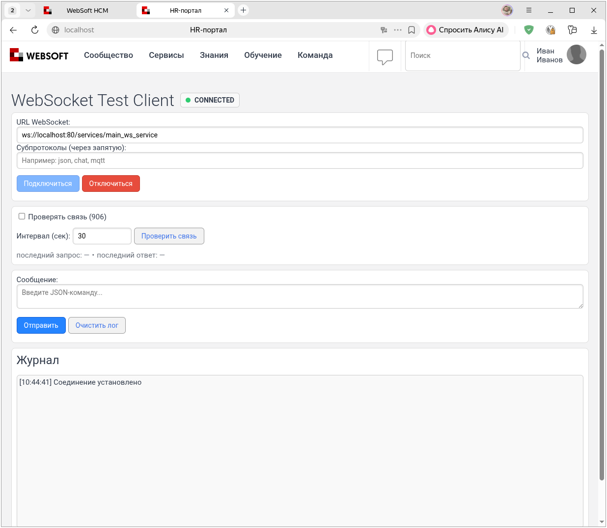
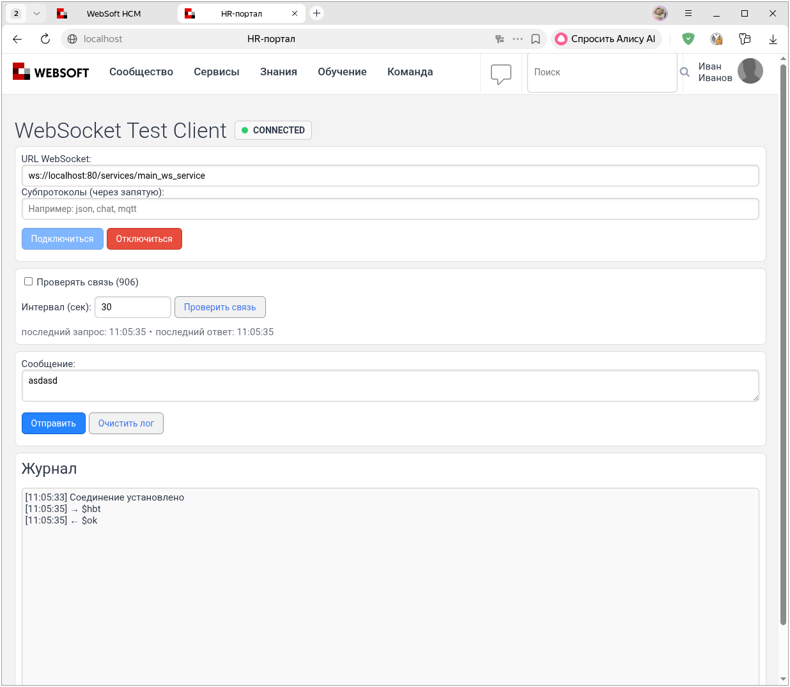

# WebSocket 906–1515: подготовка и подключение

## Подготовка

Сначала войдите в WebTutor и откройте тестовый клиент в той же браузерной сессии, на том же сервере. `main_ws_service` проверяет доступ пользователя при подключении, а `main_socket` — при обработке сообщений. Если доступ не разрешён, одного правильного URL недостаточно.

Для примеров понадобится [тестовый HTML-клиент](../ws-client.md). Создайте настраиваемый шаблон и вставьте в него код клиента.

Пример ссылки на шаблон:

```
<протокол>://<адрес сервера>/_wt/doc_type/custom_web_template_id/<ID настраиваемого шаблона>
```

!!! warning "Важно"
    В рабочем окружении используйте защищённое соединение `wss` с настроенным TLS-сертификатом. На тестовом сервере без сертификата используйте `ws` и открывайте клиент по HTTP.

## Первое подключение

Откройте тестовый клиент, введите адрес сервиса в поле `URL WebSocket` и нажмите «Подключиться». При успешном подключении появится зелёный статус `🟢 CONNECTED`.

Пример адреса сервиса:

```
ws://localhost:80/services/main_ws_service
```



## Что отправлять серверу

Для команд `main_ws_service` нужен текстовый JSON с полями действия, например
сообщение `init_socket` из [главы о группах](groups.md). В сборке 906 корневым
значением должен быть один JSON-объект. Сборки 1132, 1333 и 1515 также принимают
[массив таких команд](groups.md#batch-commands). Обычная строка `Привет` не
является JSON и вызовет ошибку разбора. Не путайте это с отправкой текста **от
сервера к клиенту** из агента.

```
11:04:15 [0HNODF8AIRVG3:00000002] Invalid JSON.
Offset: 6
(ParseJson(),  x-local://wtv/wtv_main_ws_service.js,   line 66)
(x-local://wtv/wtv_main_ws_service.js,   line 66)
```

### Проверка связи

В сборках 906, 1132, 1333 и 1515 тестовый клиент может отправлять строку `$hbt`
и отмечать ответ `$ok`. Сервер обрабатывает это служебное сообщение до вызова
`main_ws_service`, поэтому оно не попадает в `main_socket`. Автоматическая
проверка изначально выключена. На стенде это поведение проверено только для 906.



### Копия сервиса { #service-copy }

При запуске WebTutor читает файл `x-local://source/api_ext.xml` и регистрирует перечисленные в нём библиотеки. Используйте этот механизм, чтобы создать второй тестовый сервис:

1. Скопируйте `wtv_main_ws_service.xml` и `wtv_main_ws_service.js` из каталога `wtv` в каталог `source` под именами `rtk_ws_service.xml` и `rtk_ws_service.js`.
2. В `source/rtk_ws_service.xml` измените открывающий тег:

    ``` xml
    <SPXML-INLINE-FORM WEB-SERVICE-PATH="/services/rtk_ws_service" CODE-LIB="1">
    ```

    Атрибут `CODE-LIB="1"` подключает расположенный рядом файл с тем же базовым именем — `rtk_ws_service.js`.

3. Добавьте библиотеку в `source/api_ext.xml`. Если в файле уже есть другие элементы `api`, сохраните их и добавьте новый:

    ``` xml
    <api_ext>
        <apis>
            <api>
                <name>rtk_ws_service</name>
                <libs>
                    <lib>
                        <path>x-local://source/rtk_ws_service.xml</path>
                    </lib>
                </libs>
            </api>
        </apis>
    </api_ext>
    ```

4. При необходимости замените в `rtk_ws_service.js` диагностическую подпись `wtv_main_ws_service.js` на `rtk_ws_service.js`. На работу сервиса эта строка не влияет.
5. Перезапустите WebTutor, чтобы `api_ext.xml` был обработан при старте.
6. Откройте вторую копию тестового клиента и подключите её к `ws://localhost:80/services/rtk_ws_service`. Первую оставьте подключённой к `ws://localhost:80/services/main_ws_service`.

[Далее: отправка сообщений](messages.md).
