# WebSocket 906, 1132, 1333 и 1525: группы клиентов

[Перед началом: отправка сообщений](messages.md).

## Вариант при первом подключении к сервису

До назначения тегов один из способов сгруппировать WebSocket-клиентов — включить группу в значение `X-StatefulSocketId` и разбирать его при отправке. Это соглашение примера, а не встроенный формат группировки сервера.

Откройте четыре новых тестовых соединения. В этом примере группа записана в ID; команды `init_socket` не нужны. Не используйте соединения, на которых уже выполнялись примеры с JSON-командами:

```
ws://localhost:80/services/main_ws_service?X-StatefulSocketId=id:10001::group_id:10001
ws://localhost:80/services/main_ws_service?X-StatefulSocketId=id:10002::group_id:10001
ws://localhost:80/services/main_ws_service?X-StatefulSocketId=id:10003::group_id:10002
ws://localhost:80/services/main_ws_service?X-StatefulSocketId=id:10004::group_id:10002
```

Запустите агент: общее сообщение получат все соединения с подходящим форматом ID в `main_ws_service`, а групповое — только группа `10002`:

``` javascript
// Получаем доступ к сборке .NET
var xHttpStaticAssembly = tools.get_object_assembly( 'XHTTPMiddlewareStatic' );

// Получаем список всех подключённых клиентов
var WebSockets = xHttpStaticAssembly.CallClassStaticMethod( 'Datex.XHTTP.WebSocketContext', 'GetWebSockets', [null, false] );

var socket;
var socketId;
var idParts;
var data;
var params_str;
var params;
var param_str;
var values;

// Рассылаем сообщение каждому клиенту
for (socket in WebSockets) {
    socketId = socket.Key;
    idParts = socketId.split('-s-');
    if (idParts.length != 2) continue;
    if (idParts[0] != '/services/main_ws_service') continue;
    data = idParts[1];
    params_str = data.split('::');
    params = {};
    for (param_str in params_str) {
        values = param_str.split(':');
        if (values.length != 2) continue;
        params.SetProperty(values[0], values[1]);
    }

    xHttpStaticAssembly.CallClassStaticMethod(
        'Datex.XHTTP.WebSocketContext',
        'WriteToWebSocketMessageQueue',
        [
            socketId,
            'Общее сообщение на socketId ' + tools.object_to_text(params, 'json'),
            false
        ]
    );

    if (params.GetOptProperty('group_id') == '10002') {
        xHttpStaticAssembly.CallClassStaticMethod(
            'Datex.XHTTP.WebSocketContext',
            'WriteToWebSocketMessageQueue',
            [
                socketId,
                'Групповое сообщение группе ' + params.GetOptProperty('group_id'),
                false
            ]
        );
    }
}
```

*группа 10001*

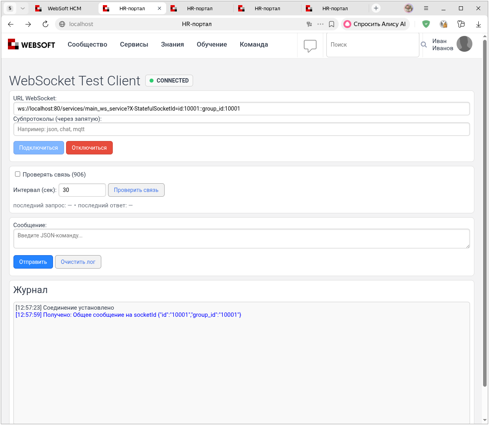

*группа 10001*

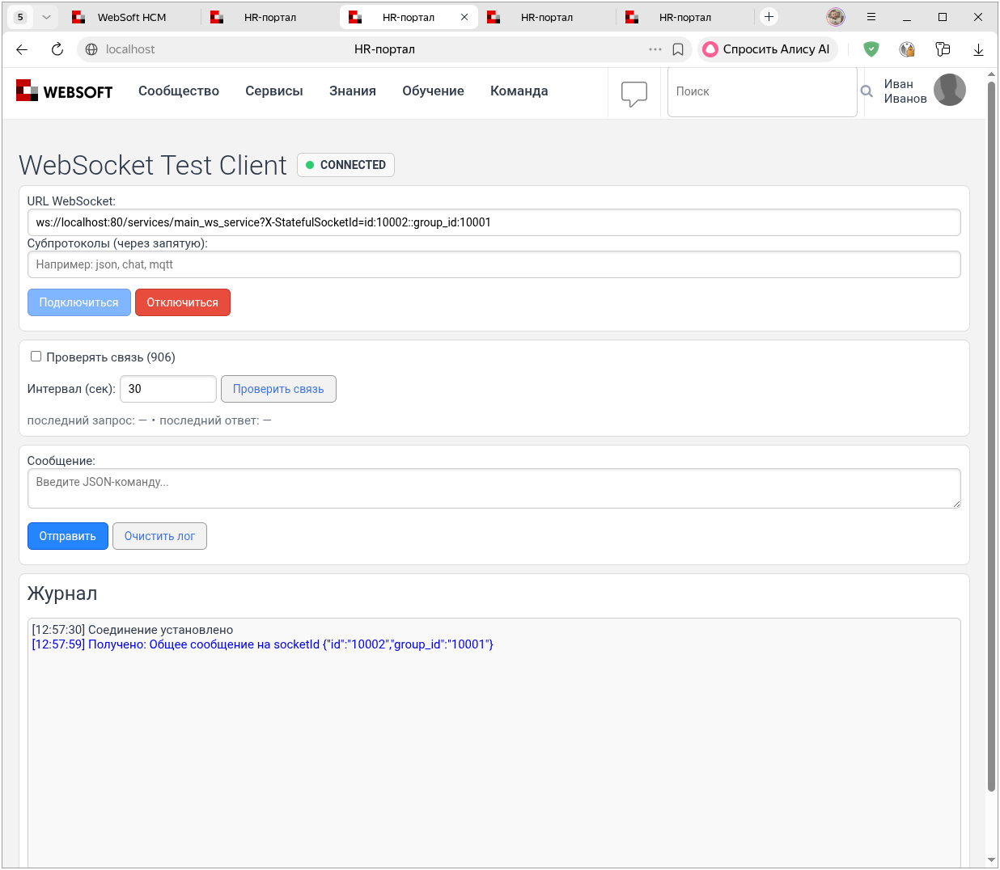

*группа 10002*

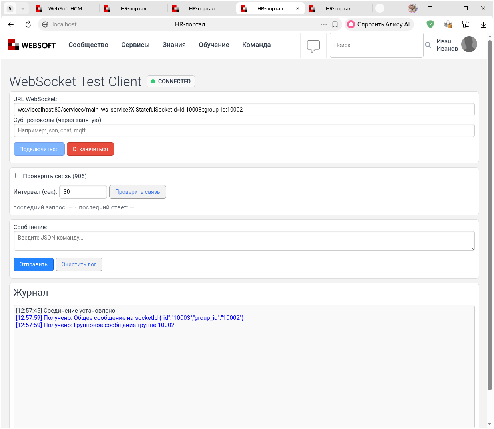

*группа 10002*

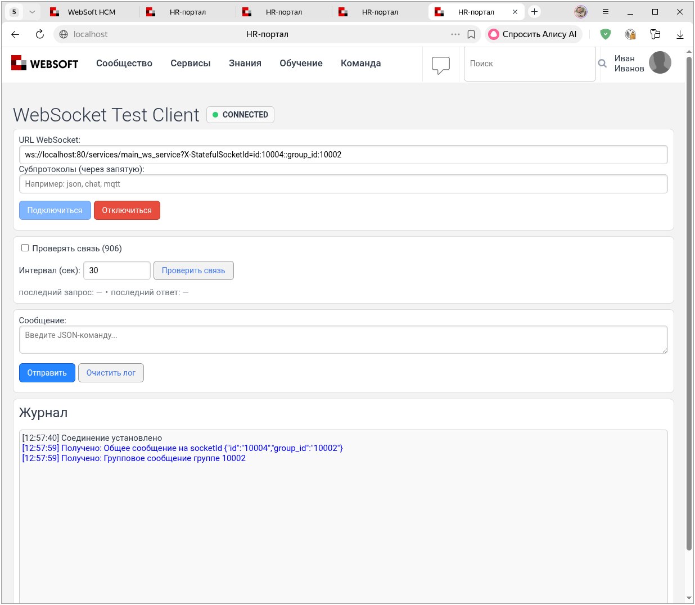

## Назначение тегов через `main_ws_service`

### Как `init_socket` формирует теги

`socket_type` — это поле команды `init_socket`. В сборках 906, 1132, 1333 и 1525
`libMain.main_socket` копирует его значение в тег соединения с тем же
именем. Поэтому `socket_type` можно использовать для группировки через API
тегов, хотя оно передаётся отдельно от массива `socket_tags`.

Перед назначением тегов `main_socket` формирует объект со служебными значениями:

- `user_id` — ID текущего пользователя в виде строки;
- `socket_type` — значение одноимённого поля команды;
- `pong` — строка `"1"`.

Затем сервис перебирает `socket_tags` и добавляет каждый элемент как тег `<name>: <value>`. Произвольные теги обрабатываются после служебных, поэтому могут перезаписать даже `user_id`, `socket_type` или `pong`. Готовый объект целиком передаётся в `SetTagsFromJson`.

Для назначения нужны следующие поля:

- `socket_action: "init_socket"` — запускает создание нового набора тегов;
- `socket_type` — становится служебным тегом `socket_type`;
- `socket_tags` — необязательный массив произвольных тегов с полями `name` и `value`;
- `uid` — необязательный идентификатор, который сервис возвращает в ответе.

Повторный `init_socket` заменяет весь набор тегов, а не дополняет существующий.

!!! warning "Теги — не проверка прав"
    Не используйте клиентские теги как доказательство личности или разрешения на действие. Значения `socket_tags` задаёт клиент, и они могут перезаписать служебные теги.

### Назначьте и проверьте теги

Откройте новое соединение с ID `777`. Не запускайте на нём агенты из предыдущего опыта с обычным текстом: режим очереди задаётся при её создании.

```
ws://localhost:80/services/main_ws_service?X-StatefulSocketId=777
```

Отправьте из клиента текстовую JSON-команду:

``` json
{
    "socket_action": "init_socket",
    "socket_type": "ws_group",
    "uid": "join-1",
    "socket_tags": [{"name": "is_person", "value": "1"}, {"name": "pid", "value": "111111111"}]
}
```

После обработки команда создаст следующий набор тегов:

| Источник значения | Тег | Значение |
| --- | --- | --- |
| Контекст пользователя | `user_id` | ID текущего пользователя в виде строки |
| Поле `socket_type` | `socket_type` | `ws_group` |
| Служебное значение | `pong` | `"1"` |
| Массив `socket_tags` | `is_person` | `"1"` |
| Массив `socket_tags` | `pid` | `"111111111"` |

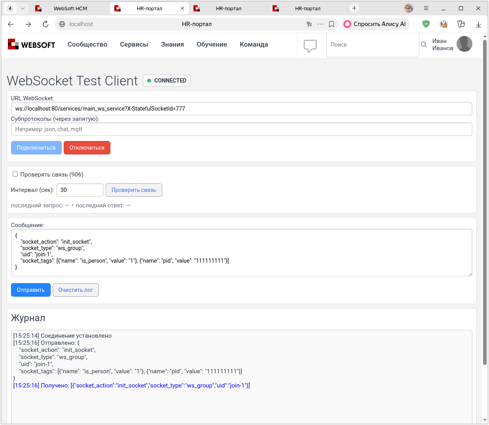

Сервис возвращает результат команды без самих тегов. Объект ответа:

``` json
{"socket_action":"init_socket","socket_type":"ws_group","uid":"join-1"}
```

Сервис отправляет объект ответа с `json_compound = true`. При созданной в этом режиме очереди клиент получает массив, например:

``` json
[{"socket_action":"init_socket","socket_type":"ws_group","uid":"join-1"}]
```

В одном кадре могут объединяться несколько ответов. Сопоставляйте их с запросами по `uid`, а не только по порядку получения. Теги в ответ не включаются.

## Пакет команд в сборках 1132, 1333 и 1525 { #batch-commands }

Начиная со сборки 1132 `main_socket` принимает не только один объект, но и
JSON-массив команд. Команды выполняются последовательно, для каждой формируется
отдельный ответ.

Чтобы не менять теги соединения `777` из основного примера, для проверки
откройте отдельное соединение:

```
ws://localhost:80/services/main_ws_service?X-StatefulSocketId=batch-test
```

Отправьте в него допустимое для 1132, 1333 и 1525 сообщение:

``` json
[
    {
        "socket_action": "init_socket",
        "socket_type": "batch-first",
        "uid": "batch-1"
    },
    {
        "socket_action": "init_socket",
        "socket_type": "batch-second",
        "uid": "batch-2"
    }
]
```

Обе команды сформируют ответы, но второй `init_socket` заменит теги,
установленные первым. После выполнения на соединении останутся `user_id`,
`pong` и `socket_type = "batch-second"`.

Ответы могут прийти вместе или отдельными сообщениями. Сопоставляйте их с
командами по `uid`.

!!! warning "Ограничение сборки 1132"
    Если одна команда в массиве завершится ошибкой, обработка ошибки и
    оставшихся команд может пройти некорректно. В 1333 это исправлено.
    Успешные команды это ограничение не затрагивает.

Сборка 906 массив команд не поддерживает. Для совместимого со сборками
906, 1132, 1333 и 1525 клиента отправляйте по одному JSON-объекту.

Создайте агент со следующим кодом и запустите его, чтобы вывести теги соединений:

``` javascript
var xHttpStaticAssembly = tools.get_object_assembly( 'XHTTPMiddlewareStatic' );
var arrWebSockets = xHttpStaticAssembly.CallClassStaticMethod('Datex.XHTTP.WebSocketContext', 'GetWebSockets', [null, false]);
var socket;
var tag;

for (socket in arrWebSockets) {
    if (socket.Key != '/services/main_ws_service-s-777') continue;
    alert(socket.Key);
    for (tag in socket.Value.Tags) {
        alert(tag.Key + ": " + tag.Value);
    }
}
```

Пример вывода в журнале:

```
15:27:08 [0303] /services/main_ws_service-s-777
15:27:08 [0303] pong: 1
15:27:08 [0303] user_id: 6148914691236517121
15:27:08 [0303] pid: 111111111
15:27:08 [0303] socket_type: ws_group
15:27:08 [0303] is_person: 1
```

## Отправка по тегам

Соединение `777` выше использовалось только для назначения и просмотра тегов. Для сравнения трёх способов отбора откройте отдельные соединения:

```
ws://localhost:80/services/main_ws_service?X-StatefulSocketId=111
ws://localhost:80/services/main_ws_service?X-StatefulSocketId=222
ws://localhost:80/services/main_ws_service?X-StatefulSocketId=333
```

Из клиента `111` отправьте:

``` json
{
    "socket_action": "init_socket",
    "socket_type": "send_group",
    "uid": "tags-111",
    "socket_tags": [{"name": "is_person", "value": "1"}]
}
```

Из клиента `222` отправьте:

``` json
{
    "socket_action": "init_socket",
    "socket_type": "send_group",
    "uid": "tags-222",
    "socket_tags": [{"name": "is_person", "value": "0"}]
}
```

Из клиента `333` отправьте:

``` json
{
    "socket_action": "init_socket",
    "socket_type": "other_group",
    "uid": "tags-333",
    "socket_tags": [{"name": "is_person", "value": "1"}]
}
```

Итоговые значения, которые используются ниже:

| Клиент | `socket_type` | `is_person` |
| --- | --- | --- |
| `111` | `send_group` | `"1"` |
| `222` | `send_group` | `"0"` |
| `333` | `other_group` | `"1"` |

Все три клиента отправили `init_socket`, поэтому ответы сервиса создали для них очереди с `json_compound = true`. Агенты ниже передают сериализованный JSON-объект с полем `text`.

### Поиск тега в цикле

Первый способ — получить соединения без фильтра, перебрать их теги и сравнить имя и значение. Создайте агент со следующим кодом и запустите его:

``` javascript
var xHttpStaticAssembly = tools.get_object_assembly( 'XHTTPMiddlewareStatic' );
var arrWebSockets = xHttpStaticAssembly.CallClassStaticMethod('Datex.XHTTP.WebSocketContext', 'GetWebSockets', [null, false]);
var socket;
var tag;

for (socket in arrWebSockets) {
    if (!StrBegins(socket.Key, '/services/main_ws_service-')) continue;
    alert(socket.Key);
    for (tag in socket.Value.Tags) {
        if (tag.Key == "socket_type" && tag.Value == "send_group") {
            xHttpStaticAssembly.CallClassStaticMethod(
                'Datex.XHTTP.WebSocketContext',
                'WriteToWebSocketMessageQueue',
                [ socket.Key, EncodeJson({ text: 'Сообщение группе send_group' }, { ExportLargeIntegersAsStrings: true }), true ]);
        }
    }
}
```

Сообщение должны получить клиенты `111` и `222`. Клиент `333` его не получит.

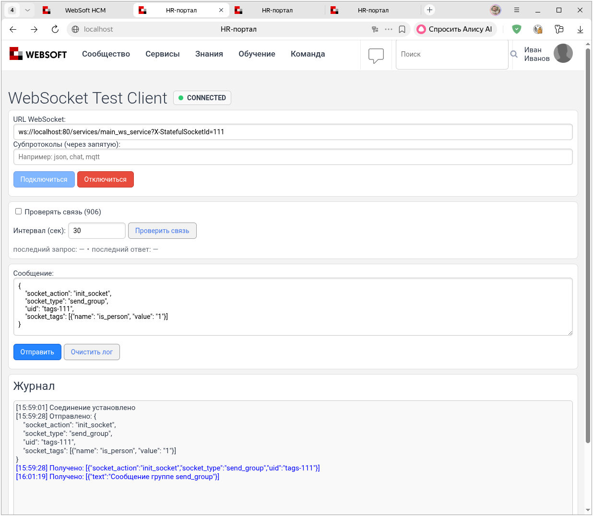

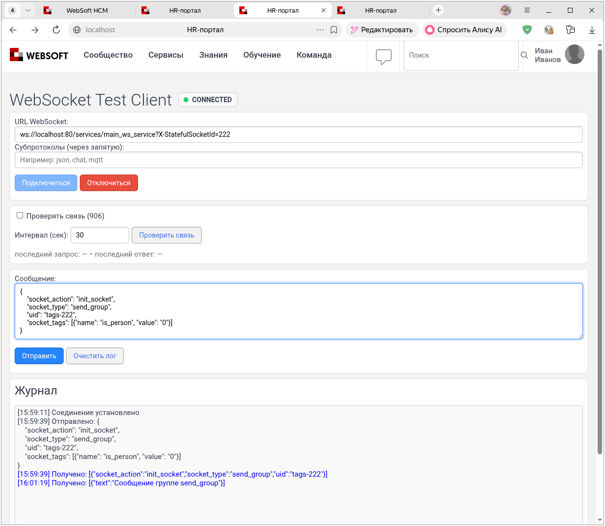

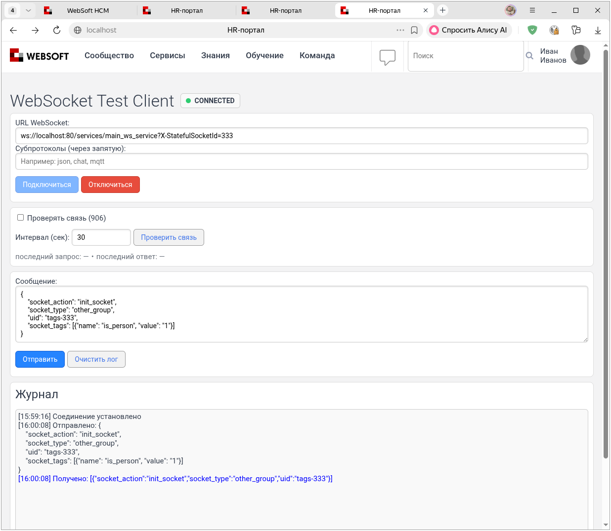

### Фильтр `GetWebSockets` по `socket_type`

Теперь выполните тот же отбор на клиентах `111`, `222` и `333` встроенным фильтром `GetWebSockets`. Фильтр `"$socket_type:send_group"` выбирает соединения по тегу `socket_type` со значением `send_group`. Второй аргумент `true` — `force_remote`: он запрашивает также удалённые соединения, а не включает фильтрацию.

Фильтр не ограничен одним сервисом, поэтому после отбора по тегу агент дополнительно проверяет путь `main_ws_service`:

``` javascript
var xHttpStaticAssembly = tools.get_object_assembly( 'XHTTPMiddlewareStatic' );
var arrWebSockets = xHttpStaticAssembly.CallClassStaticMethod(
    'Datex.XHTTP.WebSocketContext',
    'GetWebSockets',
    ["$socket_type:send_group", true]
);
var socket;

for (socket in arrWebSockets) {
    if (!StrBegins(socket.Key, '/services/main_ws_service-')) continue;
    alert(socket.Key);
    xHttpStaticAssembly.CallClassStaticMethod(
        'Datex.XHTTP.WebSocketContext',
        'WriteToWebSocketMessageQueue',
        [ socket.Key, EncodeJson({ text: 'Сообщение группе send_group' }, { ExportLargeIntegersAsStrings: true }), true ]);
}
```

Сообщение должны получить клиенты `111` и `222`. Клиент `333` его не получит:

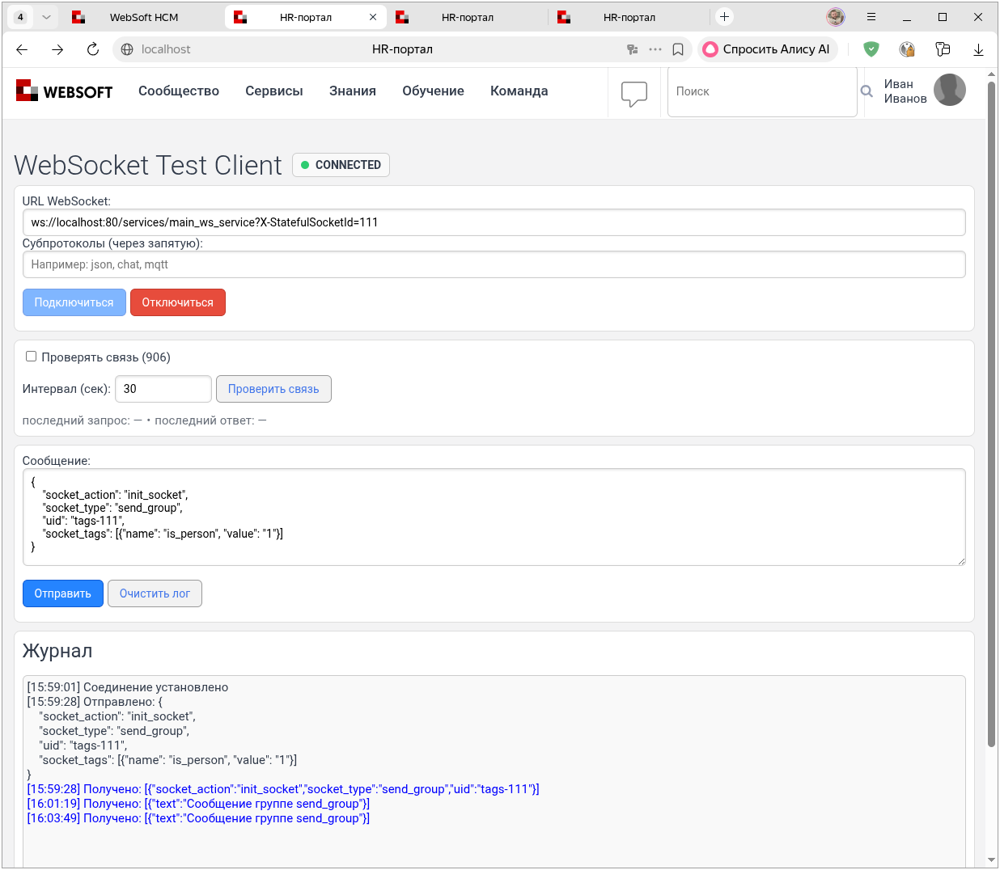

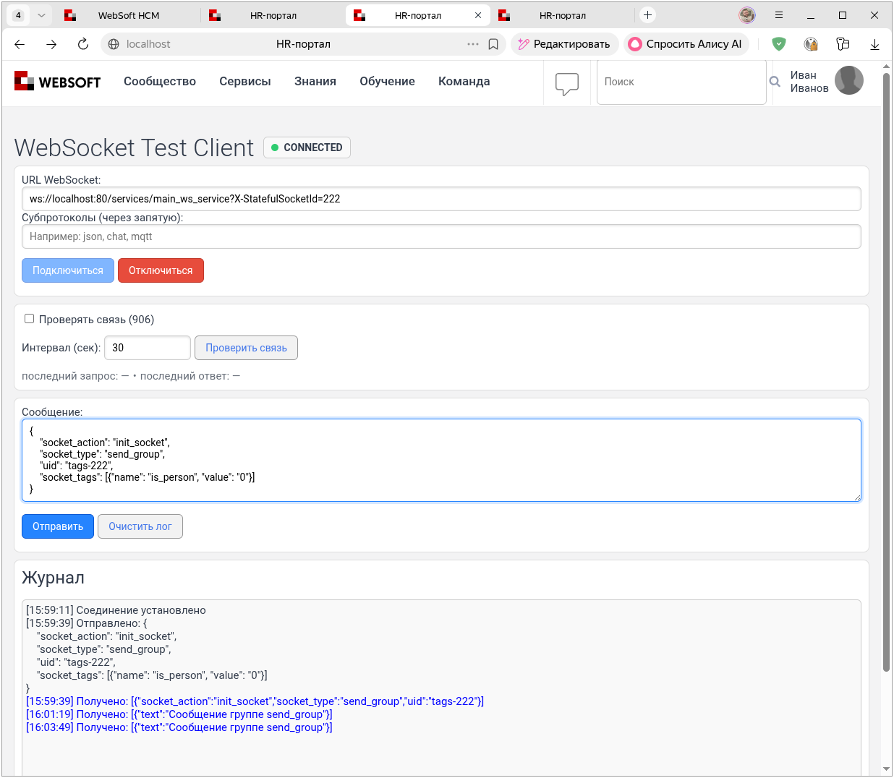


### Фильтр `GetWebSockets` по произвольному тегу

Клиенты отличаются и произвольным тегом `is_person` из массива `socket_tags`. Фильтр `"$is_person:1"` должен выбрать клиентов `111` и `333`, но не `222`.

Создайте и запустите агент:

``` javascript
var xHttpStaticAssembly = tools.get_object_assembly( 'XHTTPMiddlewareStatic' );
var arrWebSockets = xHttpStaticAssembly.CallClassStaticMethod(
    'Datex.XHTTP.WebSocketContext',
    'GetWebSockets',
    ["$is_person:1", true]
);
var socket;

for (socket in arrWebSockets) {
    if (!StrBegins(socket.Key, '/services/main_ws_service-')) continue;
    alert(socket.Key);
    xHttpStaticAssembly.CallClassStaticMethod(
        'Datex.XHTTP.WebSocketContext',
        'WriteToWebSocketMessageQueue',
        [ socket.Key, EncodeJson({ text: 'Сообщение для is_person=1' }, { ExportLargeIntegersAsStrings: true }), true ]);
}
```

Сообщение должны получить клиенты `111` и `333`. Клиент `222` останется без нового сообщения.

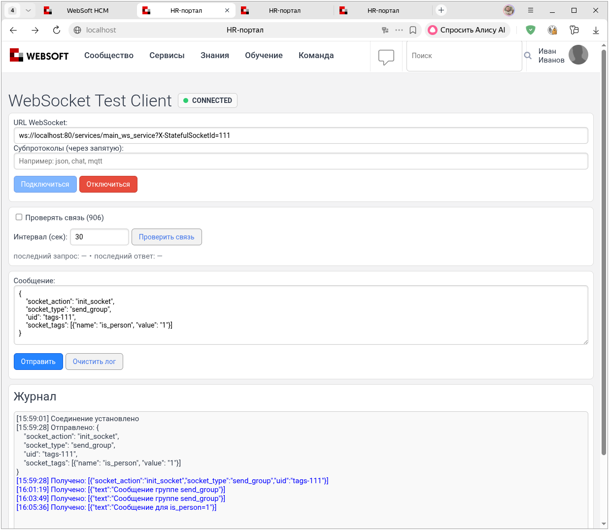


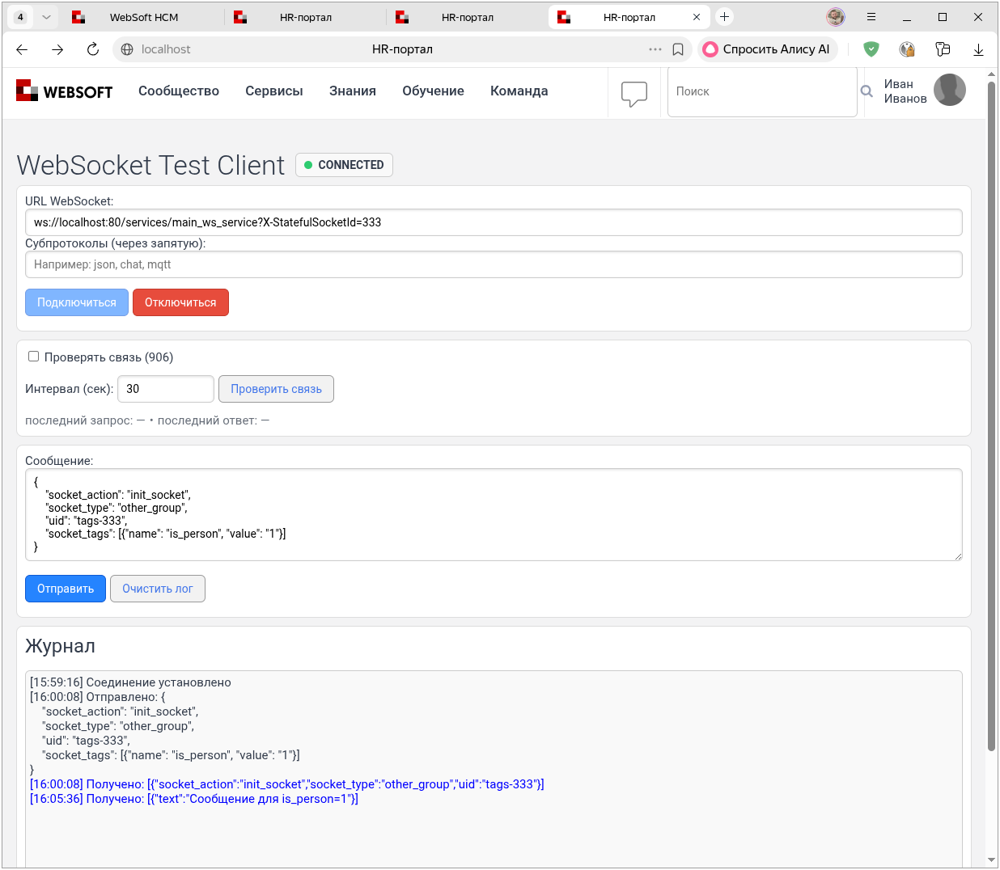

### Возможности и ограничения фильтра `GetWebSockets`

В Datex.XHTTP `1.24.4.27` сокращённый фильтр тегов имеет следующие формы:

| Фильтр | Результат |
| --- | --- |
| `null` | Все доступные соединения без отбора по тегам |
| `"$is_person"` | Соединения, у которых существует тег `is_person` |
| `"$is_person:1"` | Соединения с тегом `is_person` и значением `"1"` |
| `"$socket_type:[send_group,other_group]"` | Соединения, у которых `socket_type` равен `send_group` **или** `other_group` |

Ограничения сокращённого синтаксиса:

- список в квадратных скобках задаёт логическое «ИЛИ» для нескольких значений **одного** тега;
- несколько разных тегов одним выражением объединить нельзя: сначала отберите по одному тегу, затем проверьте остальные через `socket.Value.Tags`;
- после запятой в списке не ставьте пробелы — парсер не удаляет их из значений;
- сравнение выполняется с текстовым представлением значения и учитывает регистр;
- синтаксис не предусматривает экранирование разделителей `:` и `,` внутри значений;
- фильтр не ограничивает выбор конкретным WebSocket-сервисом, поэтому при необходимости проверяйте префикс `socket.Key`;
- второй аргумент `force_remote` управляет запросом удалённых сокетов и не включает фильтрацию.

## Ограничения сервиса

### Вызов метода и права

Для регистрации группы `call_method` не нужен. Если используете его для других операций, учитывайте следующее ограничение.

!!! warning "Права при вызове метода"
    В обработчике `call_method` имена библиотеки и метода берутся из сообщения. В нём нет списка разрешённых методов. Вызываемый метод должен проверять права текущего пользователя на операцию; доступ к WebSocket не заменяет такую проверку.

### Если ответ не пришёл

Проверьте JSON команды, доступ пользователя и журнал сервера. При ошибке
библиотека может заполнить `error` и `message` во внешнем результате, но сервис
отправляет только `socket_object`. Поэтому нельзя рассчитывать, что любая ошибка
обязательно придёт клиенту как JSON с полем `error`. Для массива команд в 1132
дополнительно действует описанное выше ограничение пакетной обработки.

[Далее: работа с тегами](tags.md).
