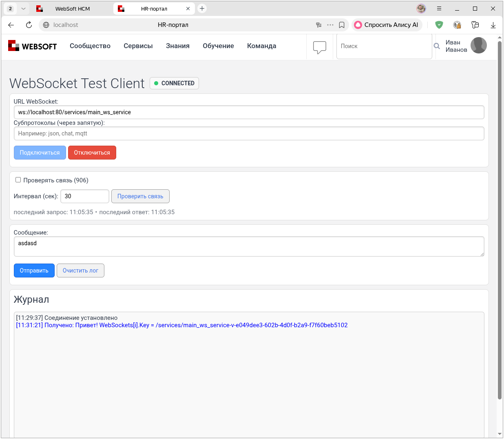
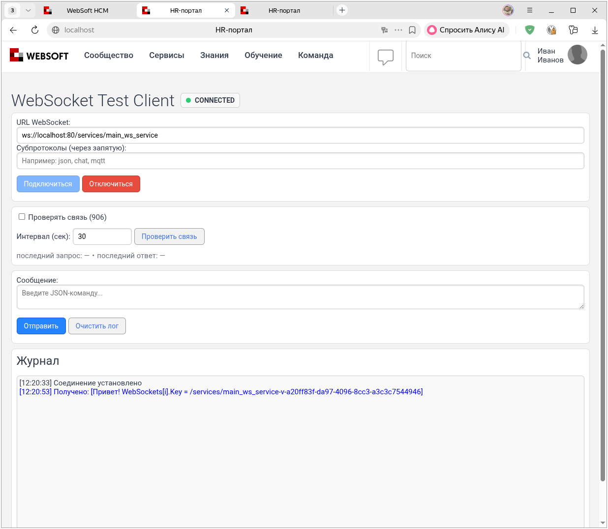
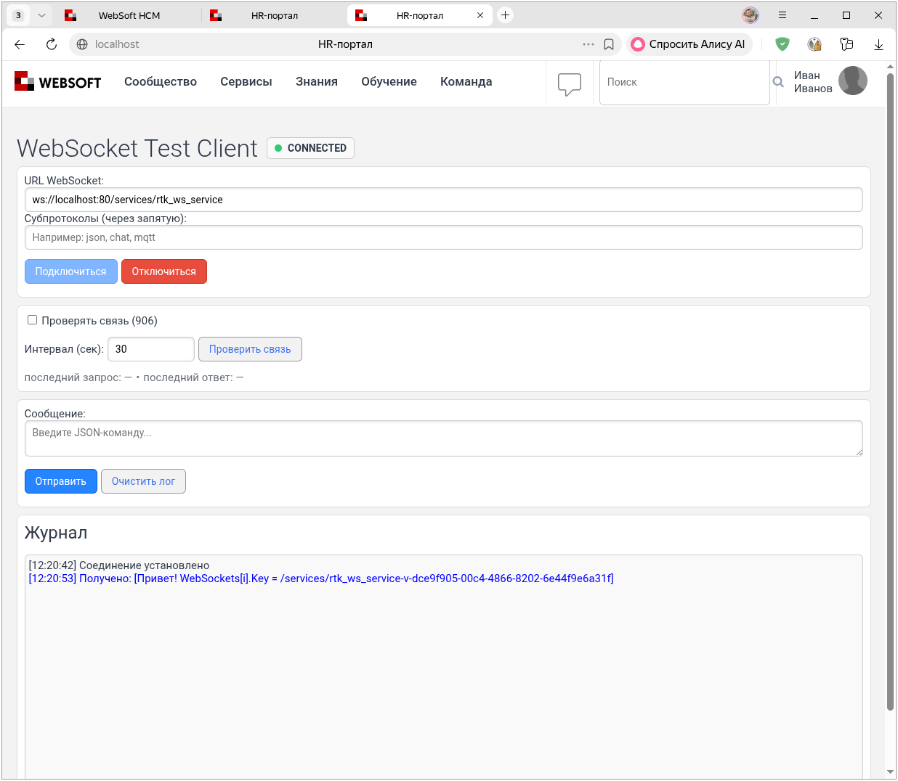
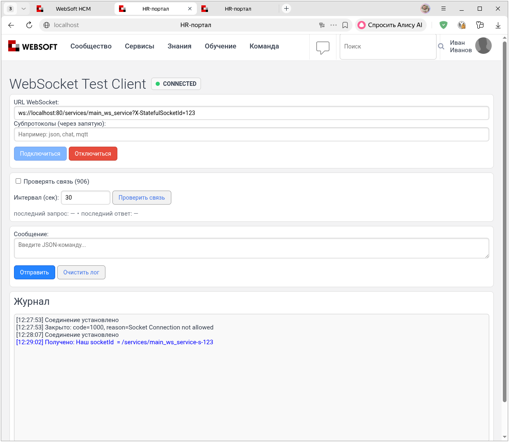
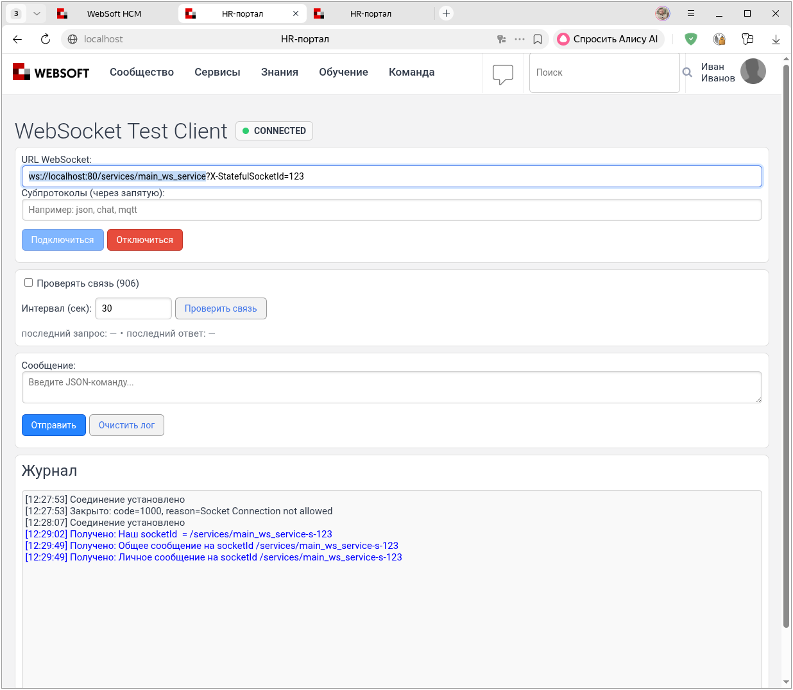
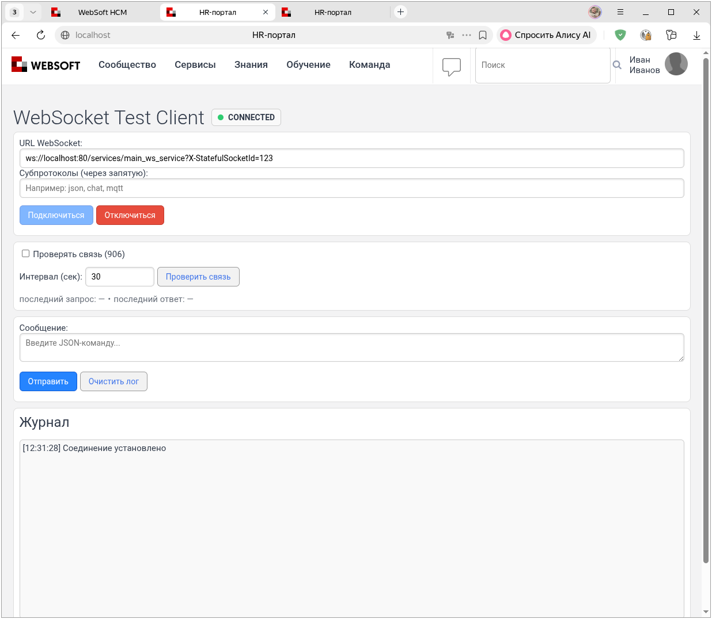
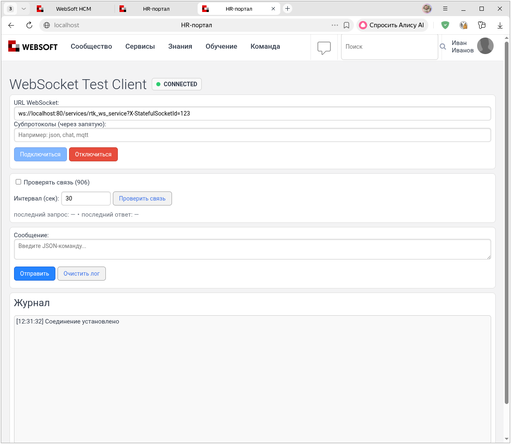

# WebSocket 906, 1132, 1333 и 1525: отправка сообщений

[Перед началом: подготовка и подключение](connection.md).

## Первое сообщение

Сначала проверим отправку обычного текста **от сервера к клиенту**. Откройте новое тестовое соединение без параметра `X-StatefulSocketId`. Сервер автоматически присвоит ему ID вида `/services/main_ws_service-v-<GUID>`.

```
ws://localhost:80/services/main_ws_service
```

Пока не отправляйте команды серверу, включая `init_socket`: для первого сообщения очередь должна быть создана агентом в текстовом режиме.

Создайте агент со следующим кодом и запустите его. Он рассылает сообщение всем найденным соединениям, поэтому выполняйте пример только на изолированном тестовом стенде:

``` javascript
// Получаем доступ к сборке .NET
var xHttpStaticAssembly = tools.get_object_assembly( 'XHTTPMiddlewareStatic' );

// Получаем список всех сокетов
var WebSockets = xHttpStaticAssembly.CallClassStaticMethod( 'Datex.XHTTP.WebSocketContext', 'GetWebSockets', [null, false] );

// Для первого запуска используйте false, для второго — true
var jsonCompound = false;

// Рассылаем сообщение каждому клиенту
var socket;
for (socket in WebSockets) {
    xHttpStaticAssembly.CallClassStaticMethod(
        'Datex.XHTTP.WebSocketContext',
        'WriteToWebSocketMessageQueue',
        [
            socket.Key,
            'Привет! socket.Key = ' + socket.Key,
            jsonCompound
        ]
    );
}
```

`get_object_assembly` — это функция WebTutor, которая загружает .NET-сборку (Datex.XHTTP.dll) и возвращает объект-обёртку, позволяющий вызывать статические методы классов внутри неё.

`GetWebSockets()` — это статический метод из Datex.XHTTP.WebSocketContext, который возвращает коллекцию `IEnumerable<KeyValuePair<string, WebSocket>>`, где:

* `Key` — строковый идентификатор соединения (socketId), уникальный для каждого клиента

* `Value` — объект System.Net.WebSockets.WebSocket, сам сокет клиента

В Datex.XHTTP `1.24.4.27` сигнатура C# — `GetWebSockets(string filter_lambda, bool force_remote = false)`. Значение `null` отключает фильтр; в примерах ниже используется явный список аргументов `[null, false]`. В распределённой конфигурации перечисление может включать удалённые соединения.

В сборке 1525 коллекцию нужно перебирать напрямую: вызов `.ToArray()` через
SP-XML-обёртку завершается ошибкой `Unknown method: ToArray()`. Прямой перебор
проверен на стенде 1525. На стенде 906 примеры выполнялись с `.ToArray()`;
прямой перебор там отдельно не проверялся.

`WriteToWebSocketMessageQueue` добавляет сообщение в очередь указанного соединения. Внутренний обработчик `WebSocketContext` отправляет сообщения асинхронно. Параметры:

* `socketId` — идентификатор WebSocket-соединения (тот самый `socket.Key`)

* `message` — текст сообщения, который будет отправлен клиенту

* `json_compound` — режим объединения сообщений очереди; для обычного текста используйте `false`

На клиенте появится строка `Привет! socket.Key = ...` с автоматически созданным ID соединения.



### Режим очереди `json_compound` { #json-queue }

Это по-прежнему отправка сообщений **от сервера к клиенту**. Параметр `json_compound` определяет, в каком виде DLL забирает сообщения из серверной очереди перед отправкой:

- `false` — каждое сообщение отправляется без дополнительной упаковки;
- `true` — DLL объединяет накопленные элементы очереди и заключает их в JSON-массив.

В сборке 906 режим запоминается при создании очереди соединения. Последующий вызов с другим значением не переключает уже существующую очередь.

Именно поэтому для первого примера нужно новое соединение без предварительных команд. Если клиент уже отправил `init_socket`, сервис `main_ws_service` сформировал ответ через `WriteToWebSocketMessageQueue(..., true)` и тем самым мог первым создать для соединения очередь в режиме JSON. После этого обычная строка от агента попадёт в ту же очередь и будет обёрнута в квадратные скобки.

В Datex.XHTTP `1.24.4.27` режим `json_compound = true` не превращает произвольный текст в JSON: обработчик соединяет сообщения запятыми и добавляет `[` и `]`. Сериализуйте каждый объект заранее, например через `EncodeJson(oMessage)`.

Если первое сообщение уже начинается с `[`, DLL отправляет его без дополнительного объединения. В остальных случаях передавайте отдельные JSON-объекты, а не готовые массивы.

Для проверки `json_compound = true` откройте вторую копию клиента и подключитесь без параметра `X-StatefulSocketId`:

```
ws://localhost:80/services/main_ws_service
```

В существующем агенте измените `jsonCompound` с `false` на `true` и запустите его повторно. Агент обойдёт оба соединения:

- очередь первого соединения уже создана с `false`, поэтому её режим не изменится и клиент получит обычную строку;
- для второго соединения очередь будет создана с `true`, поэтому клиент получит строку в квадратных скобках.

Например, строка `Привет` превратится в `[Привет]`. Это демонстрирует упаковку очереди, но не является корректным JSON. При прикладной отправке сериализуйте объект через `EncodeJson` до вызова `WriteToWebSocketMessageQueue`.


!!! warning "Важно"
    Следующий опыт продолжает сравнение режимов и использует тот же агент:

    1. [Создайте копию `main_ws_service`](connection.md#service-copy) с именем `rtk_ws_service`, если ещё не сделали этого.
    2. Закройте два клиента из предыдущего сравнения, чтобы их сообщения не смешивались с новым результатом.
    3. Откройте два новых клиента без `X-StatefulSocketId`: один подключите к `main_ws_service`, другой — к `rtk_ws_service`. Не отправляйте из них команды сервисам.
    4. Оставьте в агенте `jsonCompound = true` и запустите его ещё раз.

    ```
    ws://localhost:80/services/main_ws_service
    ws://localhost:80/services/rtk_ws_service
    ```

    `GetWebSockets()` вернёт подключения к обоим сервисам. Для каждого нового соединения агент создаст очередь с `json_compound = true`, поэтому оба клиента получат сообщение в квадратных скобках:

    

    

## Отправка конкретному клиенту

Без заданного идентификатора соединение получает `socketId` вида `/services/main_ws_service-v-<GUID>`.

Чтобы задать идентификатор, передайте параметр запроса `X-StatefulSocketId`. Полный ID включает путь сервиса: `/services/main_ws_service-s-123`.

Если соединение с таким ID ещё активно, сервер отменяет его обработку и прерывает новое подключение. После освобождения ID можно подключиться снова, но одинаковый ID сам по себе не восстанавливает теги и прикладное состояние. Механизм повторной доставки очереди зависит от настроек stateful-сокетов.

Закройте подключения из предыдущего опыта. Затем откройте новое соединение с `X-StatefulSocketId=123`:

```
ws://localhost:80/services/main_ws_service?X-StatefulSocketId=123
```

Создайте агент со следующим кодом и запустите его. Агент отправит каждому соединению его ID:

``` javascript
var xHttpStaticAssembly = tools.get_object_assembly( 'XHTTPMiddlewareStatic' );
var WebSockets = xHttpStaticAssembly.CallClassStaticMethod( 'Datex.XHTTP.WebSocketContext', 'GetWebSockets', [null, false] );

var socket;
for (socket in WebSockets) {
    xHttpStaticAssembly.CallClassStaticMethod(
        'Datex.XHTTP.WebSocketContext',
        'WriteToWebSocketMessageQueue',
        [
            socket.Key,
            'Наш socketId = ' + socket.Key,
            false
        ]
    );
}
```

*ID соединения в сообщении сервера*



Оставьте соединение с ID `123` открытым и добавьте второе — без параметра `X-StatefulSocketId`. Следующий агент отправляет общее сообщение обоим соединениям, а личное — только соединению `/services/main_ws_service-s-123`.

``` javascript
// Получаем доступ к сборке .NET
var xHttpStaticAssembly = tools.get_object_assembly( 'XHTTPMiddlewareStatic' );

// Получаем список всех подключённых клиентов
var WebSockets = xHttpStaticAssembly.CallClassStaticMethod( 'Datex.XHTTP.WebSocketContext', 'GetWebSockets', [null, false] );

// Рассылаем сообщение каждому клиенту
var socket;
var socketId;
for (socket in WebSockets) {
    socketId = socket.Key;
    xHttpStaticAssembly.CallClassStaticMethod(
        'Datex.XHTTP.WebSocketContext',
        'WriteToWebSocketMessageQueue',
        [
            socketId,
            'Общее сообщение на socketId ' + socket.Key,
            false
        ]
    );

    if (socketId != '/services/main_ws_service-s-123') continue;
    xHttpStaticAssembly.CallClassStaticMethod(
        'Datex.XHTTP.WebSocketContext',
        'WriteToWebSocketMessageQueue',
        [
            socketId,
            'Личное сообщение на socketId ' + socket.Key,
            false
        ]
    );
}
```

*Клиент с заданным `X-StatefulSocketId`*



*Клиент с автоматически созданным ID*


!!! warning "Важно"
    Значение `X-StatefulSocketId` должно быть уникальным в пределах сервиса. Соединения с одинаковым значением у `main_ws_service` и `rtk_ws_service` имеют разные полные ID:

    

    

    Оба соединения могут оставаться активными одновременно.

[Далее: группы клиентов](groups.md).
